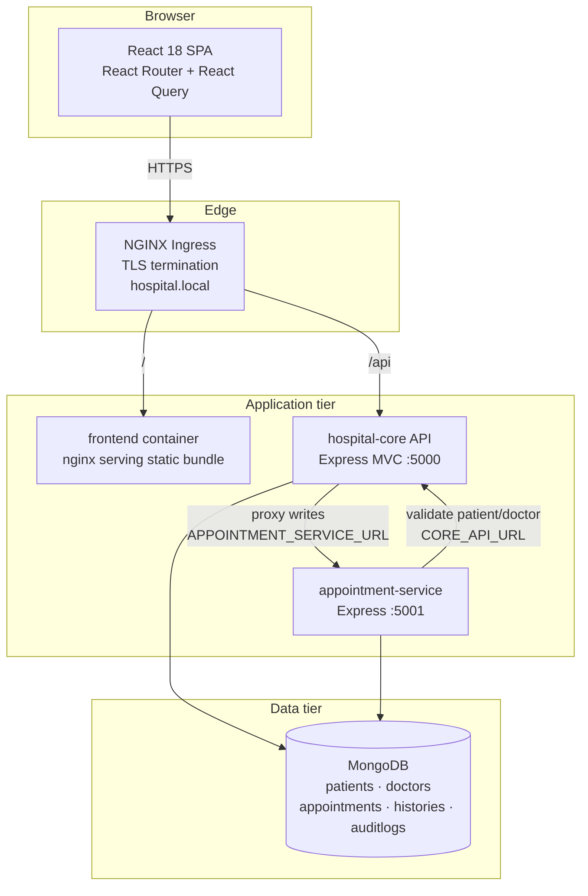
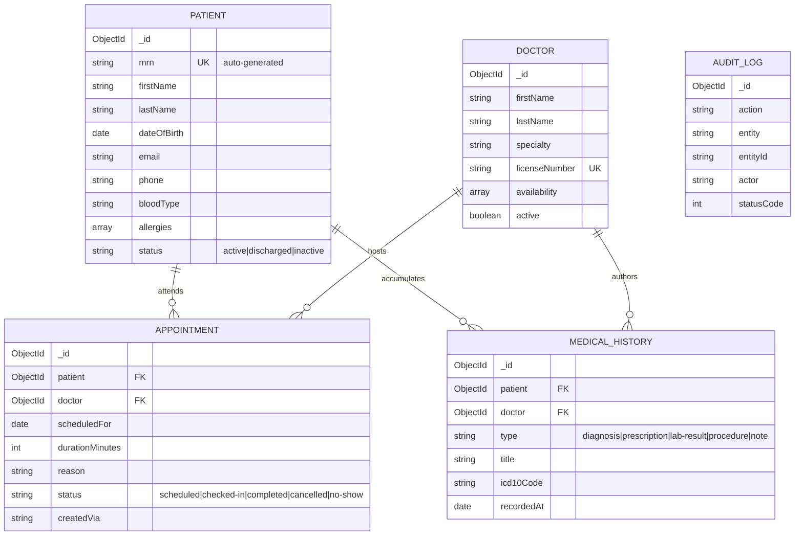

# System Architecture

## 1. Component overview



## 2. Backend MVC layering

```
Request
  │
  ▼
routes/            URL shape, HTTP verbs, express-validator rules
  │                patientRoutes · doctorRoutes · appointmentRoutes
  ▼
middleware/        validate · audit · errorHandler
  │
  ▼
controllers/       business rules, orchestration, response envelope
  │                patientController · doctorController
  │                appointmentController · statsController
  ▼
models/            Mongoose schemas, validation, indexes, virtuals
  │                Patient · Doctor · Appointment · MedicalHistory · AuditLog
  ▼
MongoDB
```

Controllers never build HTTP responses for errors directly — they `throw new
ApiError(...)` and `errorHandler` renders the one envelope shape the frontend
parses. Mongoose `ValidationError`, `CastError`, and duplicate-key `11000` are
translated there too, so a schema-level failure and a hand-thrown failure look
identical to the client.

## 3. The booking write path

```mermaid
sequenceDiagram
    participant UI as React SPA
    participant API as hospital-core :5000
    participant SVC as appointment-service :5001
    participant DB as MongoDB

    UI->>UI: optimistic cache write — slot drawn as booked
    UI->>API: POST /api/appointments
    alt APPOINTMENT_SERVICE_URL is set
        API->>SVC: POST /appointments (proxied)
        SVC->>API: GET /patients/:id, GET /doctors/:id
        API->>DB: verify both exist
        API-->>SVC: 200 / 404
        SVC->>DB: check slot conflict
        alt slot free
            SVC->>DB: insert appointment
            SVC-->>API: 201 Created
        else slot taken
            SVC-->>API: 409 Conflict
        end
        API-->>UI: pass through status
    else monolith mode (URL unset)
        API->>DB: validate refs + conflict, then insert
        API-->>UI: 201 / 409
    end
    UI->>UI: reconcile cache; roll back on 409
```

**Why the fallback exists.** Vercel deploys the core API as a single serverless
function, and CI runs the suite without a second process. Rather than maintain two
divergent behaviours, `appointmentController` implements the booking rules locally
and delegates only when `APPOINTMENT_SERVICE_URL` is present. The contract the SPA
sees is identical either way — only the topology changes.

**Why the schema is duplicated.** `services/appointment-service/src/models/Appointment.js`
is a copy, not an import from `backend/`. A shared filesystem import would mean the
two services could not be versioned, built, or deployed independently — which would
undo the decoupling. They agree by sharing a collection name and a unique index, not
by sharing source.

## 4. Data model



Key constraints:
- `{ doctor: 1, scheduledFor: 1 }` is **unique** — double-booking is impossible at the
  storage layer, not just in application code. Both services rely on this.
- Patients are **soft-deleted** (`status: 'inactive'`). Clinical records are never
  destroyed by an API call.
- `AuditLog` is written by `res.on('finish')`, so auditing adds no latency to the
  request path and a failed audit write can never fail a clinical operation.

## 5. Frontend cache strategy

| Query | `staleTime` | Background refetch | Why |
|---|---|---|---|
| `['stats','dashboard']` | 20s | 45s interval + on focus | Left open all shift; must stay live |
| `['appointments', …]` | 15s | 60s interval | Shared board — bookings arrive from other desks |
| `['patients', …]` | 30s | on focus | Changes slowly; `placeholderData` keeps the list stable while searching |
| `['doctors']` | 5min | — | Roster barely changes during a shift |
| `['patient', id]` | 15s | on focus | Detail view, opened deliberately |

Optimistic mutations (`useCreatePatient`, `useBookAppointment`,
`useUpdateAppointmentStatus`, `useAddHistory`, `useArchivePatient`) all follow the
same four-phase contract:

1. `onMutate` — cancel in-flight queries, **snapshot** the cache, write the predicted state
2. render — the UI updates with zero network latency
3. `onError` — restore the snapshot exactly
4. `onSettled` — invalidate so the server's canonical version wins

The snapshot in step 1 is what makes step 3 correct. Without it a rollback would have
to reconstruct prior state by guesswork.

## 6. Request lifecycle end to end

```
Browser click
  → React Query onMutate: optimistic cache write, UI updates instantly
  → fetch() to /api/*
  → NGINX Ingress: TLS termination, path routing
  → Express: helmet → cors → json → rate-limit → route
  → express-validator: 422 on malformed input
  → audit middleware: registers a finish-hook
  → controller: business rules
  → Mongoose model: schema validation, indexes
  → MongoDB
  ← response envelope { success, data } | { success, error, details }
  ← audit log written after the response flushes
  → React Query onSettled: invalidate, refetch, reconcile
```
