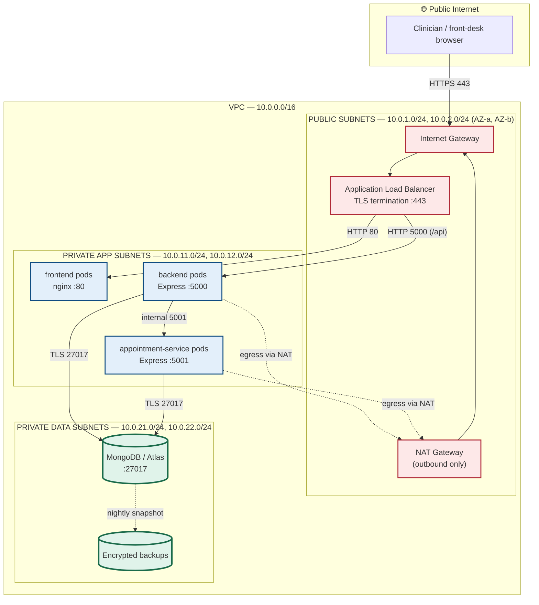

# VPC & Subnet Blueprint

How the containers in `docker-compose.yml` map onto a production Virtual Private Cloud,
and where the public/private boundary falls.

The governing rule: **patient data is never reachable from the internet.** The only
component with a public IP is the load balancer. Everything holding clinical records
sits in a private subnet with no route to an internet gateway.

---

## 1. Network topology

---

## 2. Tier-by-tier breakdown

| Tier | Subnet | CIDR | Inbound from | Public IP? | Holds patient data? |
|------|--------|------|--------------|-----------|---------------------|
| Edge | Public | `10.0.1.0/24`, `10.0.2.0/24` | Internet :443 | **Yes** | No |
| Presentation | Private app | `10.0.11.0/24`, `10.0.12.0/24` | ALB only, :80 | No | No — static assets only |
| Application | Private app | `10.0.11.0/24`, `10.0.12.0/24` | ALB :5000, mesh :5001 | No | In transit only |
| Data | Private data | `10.0.21.0/24`, `10.0.22.0/24` | App tier :27017 only | No | **Yes — at rest** |

Public subnets have a route to the Internet Gateway (`0.0.0.0/0 → igw`). Private
subnets do not: their default route goes to the NAT Gateway, so pods can pull
security updates outbound but **nothing on the internet can initiate a connection
inward**.

---

## 3. Security group rules

| Security group | Inbound | Outbound |
|---|---|---|
| `sg-alb` | `0.0.0.0/0 :443`, `:80` (redirects to 443) | `sg-frontend :80`, `sg-backend :5000` |
| `sg-frontend` | `sg-alb :80` | `sg-backend :5000`, DNS :53 |
| `sg-backend` | `sg-alb :5000` | `sg-appointments :5001`, `sg-database :27017`, DNS, NAT :443 |
| `sg-appointments` | `sg-backend :5001` | `sg-database :27017`, `sg-backend :5000`, DNS |
| `sg-database` | `sg-backend :27017`, `sg-appointments :27017` | *(none)* |

Every rule references a **security group, not a CIDR**. Pods get new IPs on every
restart; identity-based rules survive that, IP-based rules rot.

Note the last row: the database has no outbound rule at all. A compromised database
host cannot exfiltrate records to an attacker-controlled endpoint.

---

## 4. Container → cloud mapping

| `docker-compose.yml` service | Kubernetes object | VPC placement |
|---|---|---|
| `frontend` | `Deployment/frontend` + `Service/frontend-service` | Private app subnet |
| `backend` | `Deployment/backend` + `Service/backend-service` + HPA | Private app subnet |
| `appointment-service` | `Deployment/appointment-service` + HPA | Private app subnet |
| `mongo` | `StatefulSet/mongo` + headless `Service/mongo-service` + PVC | Private data subnet |
| *(compose has no equivalent)* | `Ingress/hospital-ingress` | Public subnet (ALB) |
| `hospital-net` bridge network | Namespace + `NetworkPolicy` | VPC + security groups |

The compose bridge network is the local stand-in for the VPC. Compose publishes
Mongo's port `27017` to the host purely for development convenience (Compass, seed
inspection) — **that port mapping has no production counterpart.** In Kubernetes the
database is a headless service with no NodePort and no Ingress path, and
`infra/k8s/07-network-policy.yaml` enforces the same boundary at pod level.

---

## 5. How the boundary is enforced in each environment

| Control | Docker Compose | Kubernetes (Minikube) | Production VPC |
|---|---|---|---|
| Network isolation | `hospital-net` bridge | Namespace + NetworkPolicy | Subnets + security groups |
| Public entry point | Published host ports | NGINX Ingress | ALB in public subnet |
| TLS termination | *(none — HTTP)* | Ingress + `hospital-tls` secret | ALB + ACM certificate |
| DB reachability | Service name `mongo` | `mongo-service` (headless, ClusterIP `None`) | Private subnet, no IGW route |
| Secrets | `.env` file | `Secret/hospital-db-secret` | Secrets Manager / KMS |

---

## 6. The PaaS deployment maps onto the same model

The live deployment (Netlify + Vercel + Atlas) is a managed rendering of this
blueprint — the same trust boundaries, drawn by someone else's control plane:

| Blueprint tier | Managed equivalent | Boundary control |
|---|---|---|
| Public / edge | Netlify CDN | Provider-managed TLS |
| Presentation | Netlify static hosting | Public by design — no data |
| Application | Vercel serverless functions | Env-var secrets, provider network |
| Data | **MongoDB Atlas** | IP access list + SCRAM auth + TLS in transit + encryption at rest |

Atlas is what carries the private-data-subnet guarantee here: access lists restrict
which sources may connect, and the `mongodb+srv://` scheme forces TLS. For a real
clinical deployment the next step is **Atlas VPC Peering or Private Endpoint**, which
removes the database's public endpoint entirely and reproduces the diagram above
literally rather than by policy.

---

## 7. What this design deliberately does not do

- **No database port exposed in production.** The compose port mapping is dev-only.
- **No secrets in images.** Credentials arrive as env vars from a secret store; the
  committed `01-config-secret.yaml` holds a local-only Mongo URI and says so.
- **No plaintext transit.** TLS at the edge; TLS to Atlas via `+srv`.
- **No shared blast radius between tiers.** Compromising the SPA yields static files;
  compromising the API still requires database credentials it holds only in memory.
